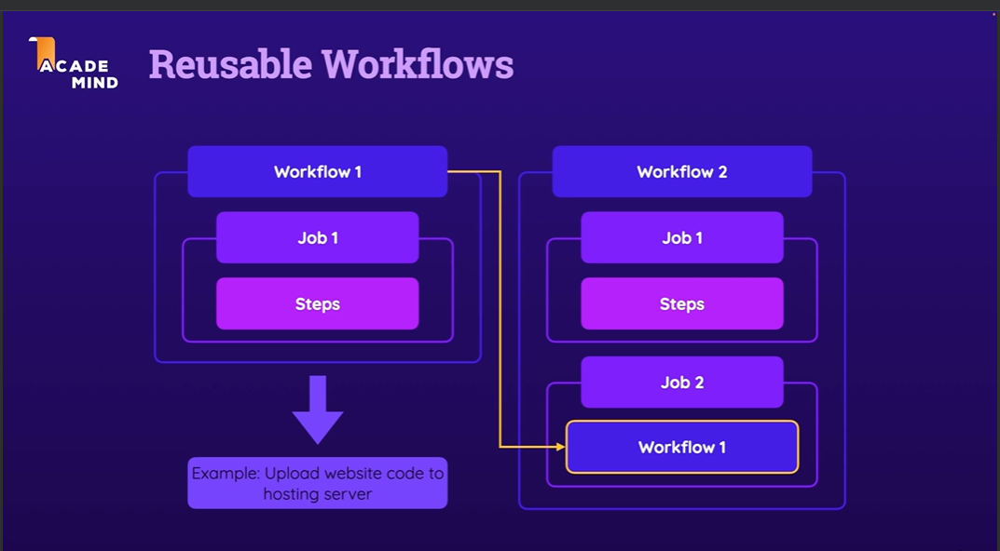
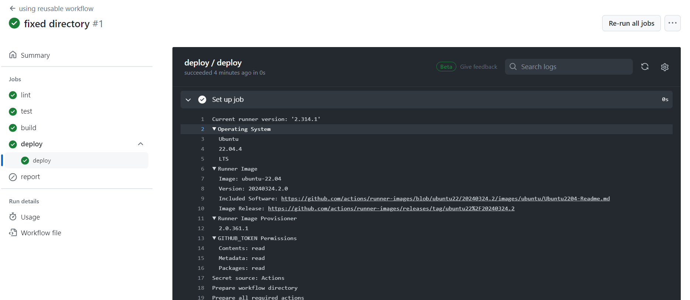
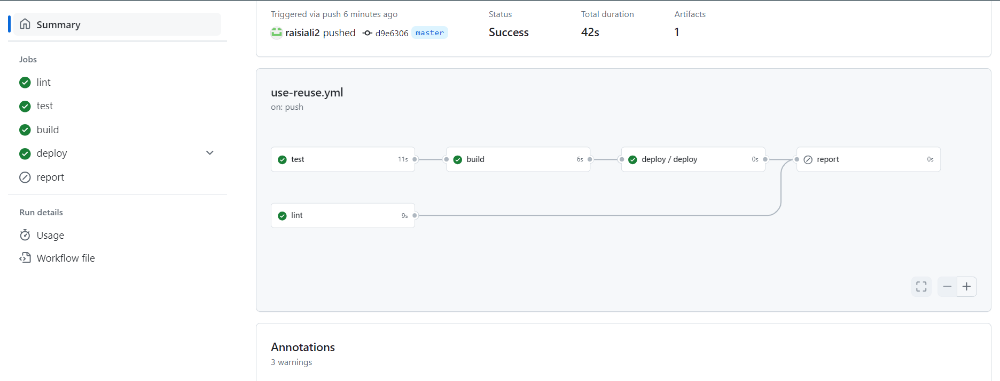
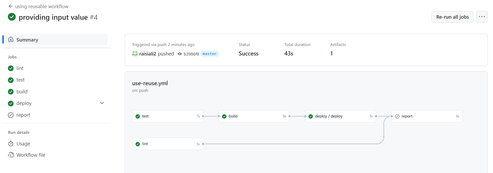
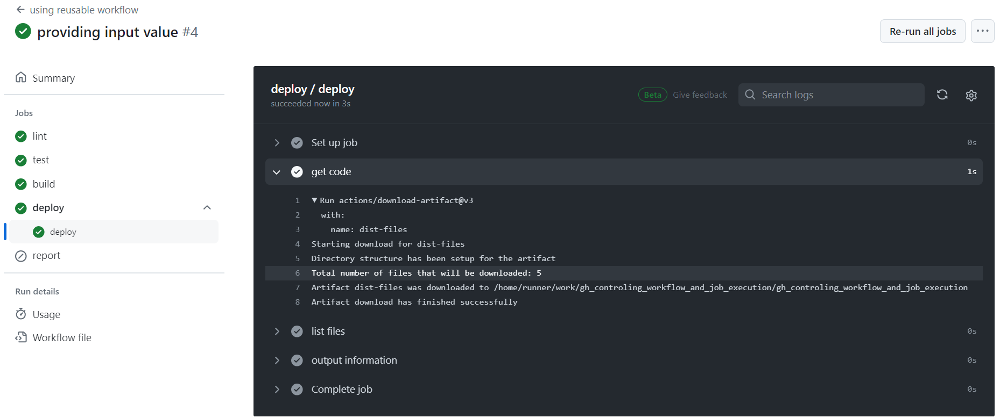
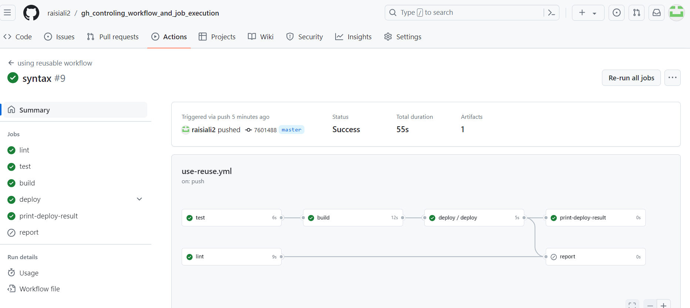
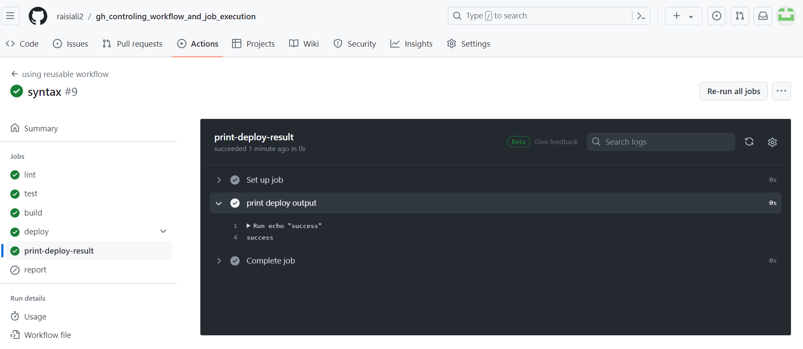
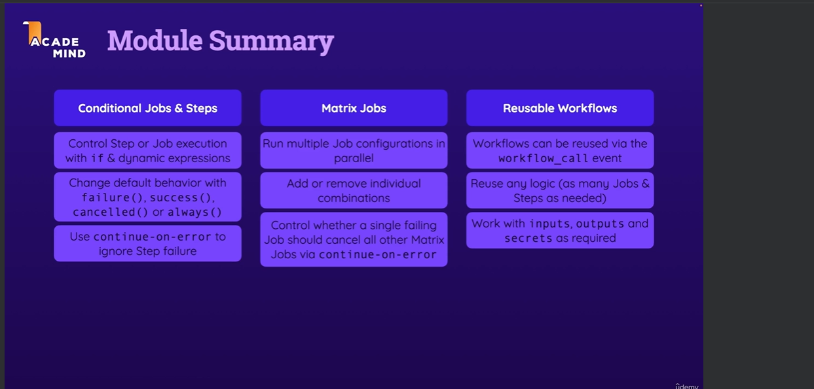

# controlling workflow and job execution
## module introduction
## understanding conditional steps & jobs
in here there is
- jobs
  - conditional execution via if field
- steps
  - conditional execution via if field 
  - ignore errors via continue-on-error field
  on the the two above fields we can evaluate condition via expressions

## demo project setup
the project contains lint, test, build and deploy the code
like build jobs build the workflow and deploy jobs download the built image then deploy to the host machine.  
yet there is no if conditions.
## understanding a (potential) problem: a failing step
the default behavior of github is like if a test fail all the dependent test will fail.
for example:
if i put condition bellow the the test report such as
```github action
- name: generate test report
  if:
```
in the above example the if condition wrote bellow the test run, it means when the test fail the condition i wrote bellow will not execute  
because it is bellow the run test action.  
in github the the action will run which is parallel and not depend on the success of previous action, such as lint which not depend on the test will execute and run even if the test action failed.  
in conclusion putting if condition in above case wont be execute because it is after test action and test action already failed.
```json
describe('MainContent', () => {
  it('should render a button', () => {
    render(<MainContent />);

    expect(screen.getByRole('button')).toBeInTheDocument();
  });

  it('should show the help area after clicking the button', async () => {
    render(<MainContent />);

    const button = screen.getByRole('button');
    await userEvent.click(button);
    expect(screen.getByTestId('help-are')).toBeInTheDocument();
  });
});

```
remove `a` from `('help-are'))` and push changes

## controlling execution via `if`
now lets add `if` condition, specifying that if previous test action failed, then generate the test report.  
but still it is not enough, even by adding the `if` condition we still see that the test action failed and report does not generated,  
because still we did not change the default behavior of github action to do that we need to use `failure()` function.

## working with special conditional function
there are 4 conditional functions in github
1. `failure()`: returns true when any previous step or job failed
2. `success()` returns true when none of the previous steps have failed
3. `always()` causes the step to always execute, even when cancelled
4. `cancelled()` returns true if the workflow has been cancelled

## conditional jobs
bellow is an example of `job-level` condition, needs sets the dependency to the other jobs.
```yml
# job level condition
  report:
    needs: [lint, deploy]
    if: failure()
    runs-on: ubuntu-latest
    steps:
      - name: output information
        run: |
          echo "something went wrong"
          echo "${{ toJson(github) }}"  
        # output the github context object
```


## more `if` examples
in here we use `if` condition in the step-level to optimize caching such as instead of caching the global `npm` in the `.npm` this time we cache the `components` folder.
```yml
- name: Cache dependencies
        id: cache
        uses: actions/cache@v3
        with:
          # path: ~/.npm
          path: node_modules
          key: deps-node-modules-${{ hashFiles('**/package-lock.json') }}
      - name: Install dependencies
        if: steps.cache.outputs.cache-hit != 'true'
        run: npm ci
```


as in this time all the previous steps ran successfully and there is no failure the `report:` job did not evaluate or executed.
```yml
  # job level condition
  report:
    needs: [lint, deploy]
    if: failure()
    runs-on: ubuntu-latest
    steps:
      - name: output information
        run: |
          echo "something went wrong"
          echo "${{ toJson(github) }}"  
        # output the github context object
```

in this 

## ignoring errors & failures with `continue-on-error`

example continue with error:
```yml
     - name: Test code
        continue-on-error: true
        id: run-tests
        run: npm run test
```


example of test broken:
```yml
      - name: Test code
        id: run-tests
        run: npm run test
      # test report make sense when we have failure report 
      # there for make if condition for that
      # like if the step run test failed     
      - name: Upload test report
        if: failure() && steps.run-tests.outcome == 'failure'
        # upload test report 
        uses: actions/upload-artifact@v3
        with:
          name: test-report
          path: test.json
```


`if check:` for executing some selective workflow


## understanding and using matrix strategies
is used one a specific job run with different configuration

```yml
name: matrix demo
on: push
jobs:
    build:
    # to run same job with different configuration use matrix
    # it might be one of the node-version does not support all the features needed
    # in this case we use continue with error because of one node other nodes evaluation or execution dont stop
        continue-on-error: true
        strategy:
            matrix:
                node-version: [12, 14, 16]
                operating-system: [ubuntu-latest, windows-latest]
        runs-on: ${{ matrix.operating-system }}
        steps:
          - name: get code
            uses: actions/checkout@v3
          - name: install nodejs
            uses: actions/setup-node@v3
            with: 
                node-version: 14
          - name: install dependencies
            run: npm ci
          - name: build project
            run: npm run build

```


## including and excluding values (matrix strategy)
the include and exclude is another two features of matrix below is example
```yml
name: matrix demo
on: push
jobs:
    build:
    # to run same job with different configuration use matrix
    # it might be one of the node-version does not support all the features needed
    # in this case we use continue with error because of one node other nodes evaluation or execution dont stop
        continue-on-error: true
        strategy:
            matrix:
                node-version: [12, 14, 16]
                operating-system: [ubuntu-latest, windows-latest]
                        # add two others matrix features
                include:
                    - node-version: 18
                      operating-system: ubuntu-latest
                exclude:
                    - node-version: 12
                      operating-system: windows-latest

        runs-on: ${{ matrix.operating-system }}

        steps:
          - name: get code
            uses: actions/checkout@v3
          - name: install nodejs
            uses: actions/setup-node@v3
            with: 
                node-version: 14
          - name: install dependencies
            run: npm ci
          - name: build project
            run: npm run build


```


## saving time and code with reusable workflows
use a workflow inside another workflow by making it callable
example of reusable workflow:

```yml
name: reusable deploy
on: workflow_call
jobs:
  deploy:
    runs-on: ubuntu-latest
    steps:
      - name: output information
        run: echo "deploying and uploading..."

```
example of use above reusable workflow:

```yml
name: using reusable workflow
on:
  push:
    branches:
      - main
      - master
jobs:
  lint:
    runs-on: ubuntu-latest
    steps:
      - name: Get code
        uses: actions/checkout@v3
      - name: Cache dependencies
        id: cache
        uses: actions/cache@v3
        with:
          # path: ~/.npm
          path: node_modules
          key: deps-node-modules-${{ hashFiles('**/package-lock.json') }}
      - name: Install dependencies
        if: steps.cache.outputs.cache-hit != 'true'
        run: npm ci
      - name: Lint code
        run: npm run lint
  test:
    runs-on: ubuntu-latest
    steps:
      - name: Get code
        uses: actions/checkout@v3
      - name: Cache dependencies
        id: cache
        uses: actions/cache@v3
        with:
        # path: ~/.npm
          path: node_modules
          key: deps-node-modules-${{ hashFiles('**/package-lock.json') }}
      - name: Install dependencies
        if: steps.cache.outputs.cache-hit != 'true'
        run: npm ci
      - name: Test code
        id: run-tests
        run: npm run test
      # test report make sense when we have failure report 
      # there for make if condition for that
      # like if the step run test failed     
      - name: Upload test report
        if: failure() && steps.run-tests.outcome == 'failure'
        # upload test report 
        uses: actions/upload-artifact@v3
        with:
          name: test-report
          path: test.json
  build:
    needs: test
    runs-on: ubuntu-latest
    steps:
      - name: Get code
        uses: actions/checkout@v3
      - name: Cache dependencies
        id: cache
        uses: actions/cache@v3
        with:
        # path: ~/.npm
          path: node_modules
          key: deps-node-modules-${{ hashFiles('**/package-lock.json') }}
      - name: Install dependencies
        if: steps.cache.outputs.cache-hit != 'true'
        run: npm ci
      - name: Build website
        id: build-website
        run: npm run build
      - name: Upload artifacts
        uses: actions/upload-artifact@v3
        with:
          name: dist-files
          path: dist
  deploy:
    needs: build
    uses: ./.github/workflows/reusable.yml
  # job level condition
  report:
    needs: [lint, deploy]
    if: failure()
    runs-on: ubuntu-latest
    steps:
      - name: output information
        run: |
          echo "something went wrong"
          echo "${{ toJson(github) }}"  
        # output the github context object
```
reusable workflow example:






## adding inputs to reusable workflows & secrets

example reusable.yaml

```yml
name: reusable deploy
on: 
  workflow_call:
    inputs:
      artifact-name:
        description: the name of the deployable artifact files
        required: false
        default: dist
        type: string

jobs:
  deploy:
    runs-on: ubuntu-latest
    steps:
      - name: get code
        uses: actions/download-artifact@v3
        with:
          name: ${{ inputs.artifact-name }}
      - name: list files
        run: ls
      - name: output information
        run: echo "deploying and uploading..."
```

example use-reuse.yml

```yml
name: using reusable workflow
on:
  push:
    branches:
      - main
      - master
jobs:
  lint:
    runs-on: ubuntu-latest
    steps:
      - name: Get code
        uses: actions/checkout@v3
      - name: Cache dependencies
        id: cache
        uses: actions/cache@v3
        with:
          # path: ~/.npm
          path: node_modules
          key: deps-node-modules-${{ hashFiles('**/package-lock.json') }}
      - name: Install dependencies
        if: steps.cache.outputs.cache-hit != 'true'
        run: npm ci
      - name: Lint code
        run: npm run lint
  test:
    runs-on: ubuntu-latest
    steps:
      - name: Get code
        uses: actions/checkout@v3
      - name: Cache dependencies
        id: cache
        uses: actions/cache@v3
        with:
        # path: ~/.npm
          path: node_modules
          key: deps-node-modules-${{ hashFiles('**/package-lock.json') }}
      - name: Install dependencies
        if: steps.cache.outputs.cache-hit != 'true'
        run: npm ci
      - name: Test code
        id: run-tests
        run: npm run test
      # test report make sense when we have failure report 
      # there for make if condition for that
      # like if the step run test failed     
      - name: Upload test report
        if: failure() && steps.run-tests.outcome == 'failure'
        # upload test report 
        uses: actions/upload-artifact@v3
        with:
          name: test-report
          path: test.json
  build:
    needs: test
    runs-on: ubuntu-latest
    steps:
      - name: Get code
        uses: actions/checkout@v3
      - name: Cache dependencies
        id: cache
        uses: actions/cache@v3
        with:
        # path: ~/.npm
          path: node_modules
          key: deps-node-modules-${{ hashFiles('**/package-lock.json') }}
      - name: Install dependencies
        if: steps.cache.outputs.cache-hit != 'true'
        run: npm ci
      - name: Build website
        id: build-website
        run: npm run build
      - name: Upload artifacts
        uses: actions/upload-artifact@v3
        with:
          name: dist-files
          path: dist
  deploy:
    needs: build
    uses: ./.github/workflows/reusable.yml
    with:
      artifact-name: dist-files
  # job level condition
  report:
    needs: [lint, deploy]
    if: failure()
    runs-on: ubuntu-latest
    steps:
      - name: output information
        run: |
          echo "something went wrong"
          echo "${{ toJson(github) }}"  
        # output the github context object
```





## reusable workflows & secrets
passing secrets in workflow

`reusable.yml`

```yml
name: reusable deploy
on: 
  workflow_call:
    inputs:
      artifact-name:
        description: the name of the deployable artifact files
        required: false
        default: dist
        type: string
      # passing secret
      # secrets:
      #   some-secret:
      #     required: false
jobs:
  deploy:
    runs-on: ubuntu-latest
    steps:
      - name: get code
        uses: actions/download-artifact@v3
        with:
          name: ${{ inputs.artifact-name }}
      - name: list files
        run: ls
      - name: output information
        run: echo "deploying and uploading..."
```

`use-reuse.yml`

```yml
name: using reusable workflow
on:
  push:
    branches:
      - main
      - master
jobs:
  lint:
    runs-on: ubuntu-latest
    steps:
      - name: Get code
        uses: actions/checkout@v3
      - name: Cache dependencies
        id: cache
        uses: actions/cache@v3
        with:
          # path: ~/.npm
          path: node_modules
          key: deps-node-modules-${{ hashFiles('**/package-lock.json') }}
      - name: Install dependencies
        if: steps.cache.outputs.cache-hit != 'true'
        run: npm ci
      - name: Lint code
        run: npm run lint
  test:
    runs-on: ubuntu-latest
    steps:
      - name: Get code
        uses: actions/checkout@v3
      - name: Cache dependencies
        id: cache
        uses: actions/cache@v3
        with:
        # path: ~/.npm
          path: node_modules
          key: deps-node-modules-${{ hashFiles('**/package-lock.json') }}
      - name: Install dependencies
        if: steps.cache.outputs.cache-hit != 'true'
        run: npm ci
      - name: Test code
        id: run-tests
        run: npm run test
      # test report make sense when we have failure report 
      # there for make if condition for that
      # like if the step run test failed     
      - name: Upload test report
        if: failure() && steps.run-tests.outcome == 'failure'
        # upload test report 
        uses: actions/upload-artifact@v3
        with:
          name: test-report
          path: test.json
  build:
    needs: test
    runs-on: ubuntu-latest
    steps:
      - name: Get code
        uses: actions/checkout@v3
      - name: Cache dependencies
        id: cache
        uses: actions/cache@v3
        with:
        # path: ~/.npm
          path: node_modules
          key: deps-node-modules-${{ hashFiles('**/package-lock.json') }}
      - name: Install dependencies
        if: steps.cache.outputs.cache-hit != 'true'
        run: npm ci
      - name: Build website
        id: build-website
        run: npm run build
      - name: Upload artifacts
        uses: actions/upload-artifact@v3
        with:
          name: dist-files
          path: dist
  deploy:
    needs: build
    uses: ./.github/workflows/reusable.yml
    with:
      artifact-name: dist-files
      # secrets:
      #   some-secret: ${{ secrets.some-secret }}
    
  # job level condition
  report:
    needs: [lint, deploy]
    if: failure()
    runs-on: ubuntu-latest
    steps:
      - name: output information
        run: |
          echo "something went wrong"
          echo "${{ toJson(github) }}"  
        # output the github context object
```

## reusable workflows outputs
the same as we set inputs for workflow we can set outputs for workflow that take outputs of step and set it as out put for job then pass it as  
output for workflow then from this workflow pass the result as output to another workflow.

`reusable.yml`

```yml
name: reusable deploy
on: 
  workflow_call:
    inputs:
      artifact-name:
        description: the name of the deployable artifact files
        required: false
        default: dist
        type: string
      # passing secret
      # secrets:
      #   some-secret:
      #     required: false
    outputs:
      result:
        description: the result of the deployment operation
        value: ${{ jobs.deploy.outputs.outcome }}
jobs:
  deploy:
    outputs:
      outcome: ${{ steps.set-result.outputs.step-result }}

    runs-on: ubuntu-latest
    steps:
      - name: get code
        uses: actions/download-artifact@v3
        with:
          name: ${{ inputs.artifact-name }}
      - name: list files
        run: ls
      - name: output information
        run: echo "deploying and uploading..."
      - name: set result output
        id: set-result
        run: echo "::set-output name=step-result::success"
```
`use-reuse.yml`

```yml
name: using reusable workflow
on:
  push:
    branches:
      - main
      - master
jobs:
  lint:
    runs-on: ubuntu-latest
    steps:
      - name: Get code
        uses: actions/checkout@v3
      - name: Cache dependencies
        id: cache
        uses: actions/cache@v3
        with:
          # path: ~/.npm
          path: node_modules
          key: deps-node-modules-${{ hashFiles('**/package-lock.json') }}
      - name: Install dependencies
        if: steps.cache.outputs.cache-hit != 'true'
        run: npm ci
      - name: Lint code
        run: npm run lint
  test:
    runs-on: ubuntu-latest
    steps:
      - name: Get code
        uses: actions/checkout@v3
      - name: Cache dependencies
        id: cache
        uses: actions/cache@v3
        with:
        # path: ~/.npm
          path: node_modules
          key: deps-node-modules-${{ hashFiles('**/package-lock.json') }}
      - name: Install dependencies
        if: steps.cache.outputs.cache-hit != 'true'
        run: npm ci
      - name: Test code
        id: run-tests
        run: npm run test
      # test report make sense when we have failure report 
      # there for make if condition for that
      # like if the step run test failed     
      - name: Upload test report
        if: failure() && steps.run-tests.outcome == 'failure'
        # upload test report 
        uses: actions/upload-artifact@v3
        with:
          name: test-report
          path: test.json
  build:
    needs: test
    runs-on: ubuntu-latest
    steps:
      - name: Get code
        uses: actions/checkout@v3
      - name: Cache dependencies
        id: cache
        uses: actions/cache@v3
        with:
        # path: ~/.npm
          path: node_modules
          key: deps-node-modules-${{ hashFiles('**/package-lock.json') }}
      - name: Install dependencies
        if: steps.cache.outputs.cache-hit != 'true'
        run: npm ci
      - name: Build website
        id: build-website
        run: npm run build
      - name: Upload artifacts
        uses: actions/upload-artifact@v3
        with:
          name: dist-files
          path: dist
  deploy:
    needs: build
    uses: ./.github/workflows/reusable.yml
    with:
      artifact-name: dist-files
      # secrets:
      #   some-secret: ${{ secrets.some-secret }}
    
  # job level condition
  print-deploy-result:
    needs: deploy
    runs-on: ubuntu-latest
    steps:
      - name: print deploy output 
        run: echo "${{ needs.deploy.outputs.result }}"
  report:
    needs: [lint, deploy]
    if: failure()
    runs-on: ubuntu-latest
    steps:
      - name: output information
        run: |
          echo "something went wrong"
          echo "${{ toJson(github) }}"  
        # output the github context object
```





## module summary
- conditional jobs & steps
  - control step or job execution with if & dynamic expressions
  - change default behavior with failure(), success(), cancelled() or always()
  - use continue-on-error to ignore step failure
- matrix jobs
  - allow a job to run based on multiple configuration
  - ignore a specific configuration for specific job
  - add or remove individual combinations
  - control whether a single failing job should cancel all other matrix jobs via continue-on-error
- reusable workflows
  - workflow can be reuse via workflow_call event
  - reuse any logic (as many jobs & steps as needed)
  - work with inputs, outputs and secret as required
  

